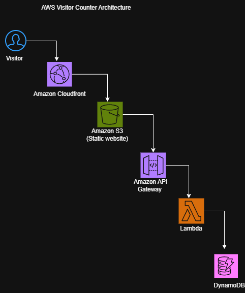

# Terraform AWS Visitor Counter

This project provisions a serverless visitor counter application on AWS using Terraform. It combines Amazon S3 for static website hosting, Amazon API Gateway, AWS Lambda, and Amazon DynamoDB to build a fully serverless architecture that records and displays website visitor counts.

## Project Overview

This project demonstrates how multiple AWS services can be integrated into a serverless application using Infrastructure as Code (Terraform).

When a visitor opens the website, the frontend sends a request to Amazon API Gateway. API Gateway invokes an AWS Lambda function, which reads and updates the visitor count stored in Amazon DynamoDB before returning the updated count to the website.

The project showcases serverless application design, cloud integration, and Terraform best practices.

## Architecture

 

### Request Flow

1. A visitor opens the static website hosted on Amazon S3.
2. Amazon CloudFront serves the website with low latency.
3. JavaScript sends a request to Amazon API Gateway.
4. API Gateway invokes an AWS Lambda function.
5. Lambda reads and updates the visitor count in Amazon DynamoDB.
6. The updated visitor count is returned to the website and displayed to the user.

## Architecture Flow

Visitor

↓

CloudFront

↓

S3 Static Website

↓

API Gateway

↓

Lambda

↓

DynamoDB

## AWS Services Used

| AWS Service | Purpose |
|-------------|---------|
| **Amazon S3** | Hosts the static website files (HTML, CSS, JavaScript). |
| **Amazon CloudFront** | Delivers website content globally with low latency and improved performance. |
| **Amazon API Gateway** | Provides an HTTP endpoint for the frontend to communicate with the backend. |
| **AWS Lambda** | Executes the backend logic to retrieve and update the visitor count. |
| **Amazon DynamoDB** | Stores and manages the website visitor count. |
| **AWS IAM** | Manages permissions and access control for AWS resources. |
| **Terraform** | Provisions and manages the entire AWS infrastructure as Infrastructure as Code (IaC). |

## Project Structure

terraform-aws-visitor-counter/

├── Diagram/

      └──  visitor-counter-architecture.png
      

├── frontend/

      ├── index.html
      ├── style.css
      └── script.js
      

├── lambda/

     └── index.py
     

├── terraform/

    ├── main.tf
    ├── provider.tf
    ├── variables.tf
    ├── outputs.tf
    └── terraform.tfvars

└── README.md

## Terraform Workflow

terraform init

terraform fmt

terraform validate

terraform plan

terraform apply

## Project Status

✅ Repository Created

✅ Architecture Diagram Created

✅ Terraform Structure Created

✅ S3 Bucket Configured

✅ DynamoDB Table Configured

✅ Lambda Function Configured

✅ API Gateway Configured

✅ Terraform Configuration Validated

✅  CloudFront Integration completed

🔄 Deployment Pending (AWS Lab Environment Required)

## Skills Demonstrated

- Infrastructure as Code (Terraform)
- Serverless Application Architecture
- Amazon S3 Static Website Hosting
- Amazon CloudFront
- Amazon API Gateway
- AWS Lambda
- Amazon DynamoDB
- IAM Permissions
- Git Version Control
- Cloud Architecture Documentation
  

## Future Improvements

- Configure a custom domain with Amazon Route 53
- Secure the application using AWS Certificate Manager (ACM)
- Build a CI/CD pipeline with GitHub Actions
- Enable monitoring with Amazon CloudWatch
- Improve IAM policies using least-privilege principles
- Add automated Terraform testing

## Deployment Notes

The infrastructure has been fully developed and validated using Terraform.

Deployment is currently pending access to an AWS account with valid credentials. This repository was intentionally designed so that infrastructure can be deployed in the future without requiring code changes.

Current Terraform workflow completed:

- terraform init ✅
- terraform fmt ✅
- terraform validate ✅
- terraform plan ⏳ (Pending valid AWS credentials)
- terraform apply ⏳ (Pending valid AWS credentials)
